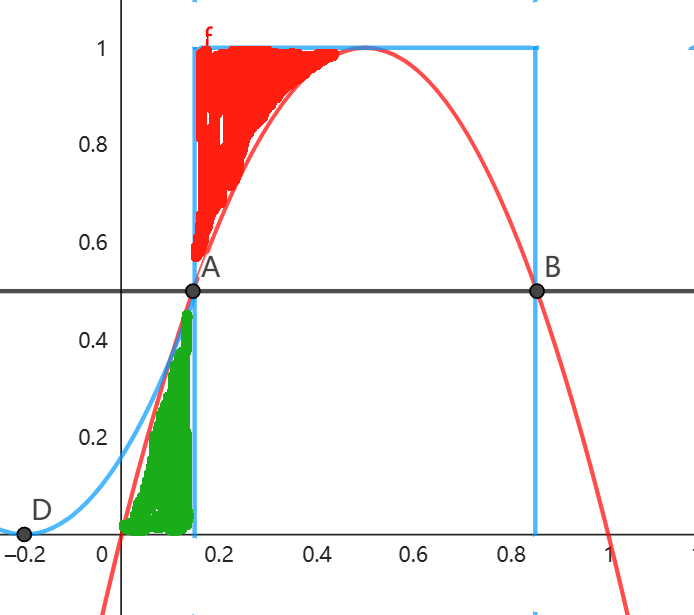

# 2024-2025微积分(甲)I期末考试部分思路

14. 已知数列$\{a_n\},\{b_n\}$满足$e^{a_n}=a_n + e^{b_n}$，其中$0 < a_n < \dfrac{1}{n^2}$。

证明: 

(1) $0 < b_n < \dfrac{3a_n^2}{4}$

(2) $\lim\limits_{n \to \infty}(\dfrac{b_1}{a_1}+\dfrac{b_2}{a_2}+\cdots+\dfrac{b_n}{a_n})$存在。

(1)$\iff 1<e^{b_n} = e^{a_n}-a_n < e^{\frac{3a_n^2}{4}}$

左边显然成立($e^x\ge x+1$)，下面考虑右边的不等式

由题：$0 < a_n < \dfrac{1}{n^2}\le 1$

$e^{a_n}-a_n < e^{\frac{3a_n^2}{4}}$

$\Leftarrow e^{a_n}-a_n < \dfrac{3a_n^2}{4} +1 \le e^{\frac{3a_n^2}{4}}$

$\Leftarrow e^x-\dfrac{3}{4}x^2-x-1 <0, \forall x\in(0,1)$

设$f(x) = e^x-\dfrac{3}{4}x^2-x-1,f'(x) = e^x-\dfrac{3}{2}x-1,f''(x) = e^x-\dfrac{3}{2}$

$f'(x)$在$(0,1)$上最大值在端点处取到，$f'(0) = 0,f'(1) = e-2.5<0$

$\therefore f(x)$在$(0,1)$上递减，$f(x)\le f(0) = 0$

!!! Note

    我们高中肯定做过这样的导数题，$e^x-ax^2-x-1\ge 0$在$(0,+\infty)$恒成立，求a的取值范围，答案是$a\le \dfrac{1}{2}$

    也就是说，最佳系数是$\dfrac{1}{2}$，本题中用分析法发现我们要证的是$\dfrac{3}{4}$是比$\dfrac{1}{2}$大的，所以$f(x)$会在$0$右边的一小段区域先负，然后随着x趋于正无穷又发散到正无穷

(2) $\dfrac{b_i}{a_i}< \dfrac{3}{4}a_i<\dfrac{3}{4i^2}, i\in \mathbb{N^+}$

用柯西收敛定理容易证明

---

15. 已知函数$f(x)$在区间$[0,1]$上有2阶导数，且$f''(x)<0$，$f(0)=f(1)=0$。证明：

(1) $f'(x)$在区间$(0,1)$内存在唯一零点$x_0$，且当$x\in(0,1)$时$f(x)>0$

(2) $\exists x_1\in(0,x_0)$，$x_2\in(x_0,1)$，使得$f(x_1)=f(x_2)=\dfrac{f(x_0)}{2}$，且$\displaystyle\int_{0}^{1}f(x)dx<f(x_0)(x_2 - x_1)$

(1) $f(1) = f(0) = 0 \Rightarrow \exists x_0\in(0,1), f'(x_0) = 0$(Rolle)

$\because f''(x)<0$所以一阶导数递减，$0<x<x_0, f'(x)>0;x_0<x<1,f'(x)<0$

$\therefore f(x)$在$(0,x_0)$上递增，在$(x_0,1)$上递减

$f(0) = f(1) = 0\Rightarrow f(x)>0, \forall x\in(0,1)$

(2)设$g(x) = f(x)-\dfrac{f(x_0)}{2}$

$g(x)$在$(0,x_0)$上递增，在$(x_0,1)$上递减

$g(0)<0,g(x_0)>0,g(1)<0\Rightarrow\exist x_1\in(0,x_0),x_2\in(x_0,1)$s.t. $g(x_1) = g(x_2) = 0$

!!! Tip

    示意图

    

至于第二问的不等式，本质上是比较面积大小

$\displaystyle\int_{0}^{1}f(x)\mathrm{d}x = \left(\displaystyle\int_{0}^{x_1}+\displaystyle\int_{x_1}^{x_2}+\displaystyle\int_{x_2}^{1}\right)f(x)\mathrm{d}x$

$f(x_0)(x_2-x_1 ) = \displaystyle\int_{x_1}^{x_2}f(x_0)\mathrm{d}x = \displaystyle\int_{x_1}^{x_2}f(x_0)-f(x)\mathrm{d}x + \displaystyle\int_{x_1}^{x_2}f(x)\mathrm{d}x$

$\therefore\displaystyle\int_{0}^{1}f(x)dx<f(x_0)(x_2 - x_1)$

$\iff\displaystyle\int_{0}^{x_1}f(x)\mathrm{d}x+\displaystyle\int_{x_2}^{1}f(x)\mathrm{d}x < \displaystyle\int_{x_1}^{x_2}f(x_0)-f(x)\mathrm{d}x$

$\Leftarrow \displaystyle\int_{0}^{x_1}f(x)\mathrm{d}x < \displaystyle\int_{x_1}^{x_0}f(x_0)-f(x)\mathrm{d}x$且$ \displaystyle\int_{x_2}^{1}f(x)\mathrm{d}x < \displaystyle\int_{x_0}^{x_2}f(x_0)-f(x)\mathrm{d}x$

!!! Tip

    先考虑第一个，本质上是左边红色和绿色部分面积的大小关系
    
    容易想到的是构造$f(x)$关于$A(x_1,\dfrac{f(x_0)}{2})$中心对称的函数$h_1(x) = f(x_0)-f(2x_1-x)$
    
    这样就可以把红色的面积移动到下面来，然后题目的凹凸性又保证了$h_1(x)$始终在$f(x)$上方，所以成立，第二个同理

先证明$2x_1<x_0\iff x_1<\dfrac{x_0}{2} \iff f(x_1)= \dfrac{f(x_0)}{2} \lt f(\dfrac{x_0}{2})$

这就是琴升不等式$\dfrac{f(x_0)+f(0)}{2} \lt f\left(\dfrac{x_0+0}{2}\right)$,证略

构造$h_1(x) = f(x_0)-f(2x_1-x),x\le x_1$

显然$h_1(2x_1-x_0) = 0,\displaystyle\int_{2x_1-x_0}^{x_1}h_1(x)\mathrm{d}x = \displaystyle\int_{x_1}^{x_0}f(x_0)-f(x)\mathrm{d}x$

下面证明，$0<x\le x_1$时，$h_1(x)\ge f(x)$

$h(x) = h_1(x)-f(x) = f(x_0)-f(2x_1-x) -f(x),h(x_1) = 0$

$h'(x) = f'(2x_1-x)-f'(x),h'(x_1) = 0$

$h''(x) = -f''(2x_1-x)-f''(x) >0 $

$\therefore h'(x)<0 ,h(x)$递减，$h(x)\ge h(x_1) = 0$

$\therefore h_1(x)\ge f(x)\Rightarrow \displaystyle\int_{0}^{x_1}h_1(x)\mathrm{d}x > \displaystyle\int_0^{x_1}f(x)\mathrm{d}x$

又$2x_1-x_0<x_0$时$h_1(x)>0$

$\therefore \displaystyle\int_{2x_1-x_0}^{x_1}h_1(x)\mathrm{d}x = \displaystyle\int_{x_1}^{x_0}f(x_0)-f(x)\mathrm{d}x > \displaystyle\int_0^{x_1}f(x)\mathrm{d}x$

第一部分证明完毕，第二部分同理

所以最后的结论成立

!!! Note

    我这种做法画图以后思路就明晰了，但是实际写下来要写的还是有点多

