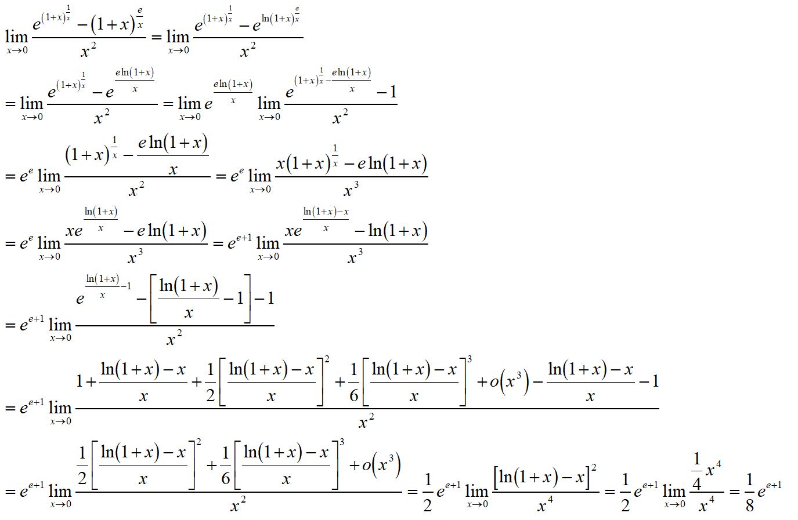

# 模拟题分析与解答

依照【考情分析】，我给同学模拟了一些题目。1-8为计算题，9为综合计算题，10-12为综合分析题

|题号|知识点|
|----|----|
|1|夹逼准则求极限|
|2|等价无穷小、泰勒展开或中值定理求极限|
|3|参数方程求导及导数定义|
|4|复合函数求导及导数定义|
|5|有理函数的不定积分、分部积分法|
|6|利用定积分定义求极限|
|7|定积分的几何应用 - 求曲线弧长|
|8|反常积分|
|9|定积分的几何应用 - 求旋转体体积|
|10|递推数列极限综合题|
|11|微分中值定理综合题（主要考察泰勒展开）|
|12|函数与积分综合题（考察导数与单调性、积分不等式）|

纵观历年的考卷，基本方法求极限方法如**等价无穷小，恒等变形，夹逼准则，泰勒展开式，洛必达法则，定积分定义**是考察的热点，我据此选了1，2，6题

函数部分，不是考察的热点，偶尔会有题目考察**渐近线，零点存在性定理**，因此我没有单独出题，但是我把反函数，介值定理等知识点融入了第8，11题中

导数部分，主要考察**导数定义，复合函数求导，参数方程求导，隐函数求导，高阶导数计算**，我选了3，4题

微分中值定理部分，我选了一个常规的泰勒展开题(11)

积分部分，不定积分选了一个题(5)，综合考察有理函数积分换元法和分部积分法。定积分的几何应用是期末考试的必考题，包括求**弧长，面积，体积**(7，9)。反常积分部分选了一个题和反函数结合考察（8），定积分综合题和函数与导数结合考察（12）

10-12难度较大，但是我均做了铺垫。总体来说这张模拟卷的难度要高于期末考试，毕竟模拟总要难一点（别打我QWQ）

## 参考答案

1.计算极限

$$
\lim\limits_{x\to0}\dfrac{\sin(x^2\sin\dfrac{1}{x})}{x}
$$

!!! Answer
    \[
    0 \leq \dfrac{\left|\sin \left( x^{2} \sin \dfrac{1}{x} \right)\right|}{|x|} \leq \dfrac{\left|x^{2} \sin \dfrac{1}{x}\right|}{|x|} \leq \dfrac{\left|x^{2}\right|}{|x|} = |x| \rightarrow 0
    \]

    \[
    \text{由夹逼准则，} \lim_{x \rightarrow 0} \dfrac{\left|\sin \left( x^{2} \sin \dfrac{1}{x} \right)\right|}{|x|} = 0, \text{ 故 } \lim_{x \rightarrow 0} \dfrac{\sin \left( x^{2} \sin \dfrac{1}{x} \right)}{x} = 0
    \]

---

2.计算极限

$$
\lim\limits_{x\to0}\dfrac{e^{(1+x)^{\frac{1}{x}}} - \left(1+x\right)^{\frac{e}{x}}}{x^2}
$$

!!! Answer
    

---

3.设函数\(y = f(x)\)由参数方程\(\begin{cases}x = 1 + t^{3}\\y = e^{t^{2}}\end{cases}\)确定，求下面的极限：

$$\lim_{x\to+\infty}x\left[f\left(2+\dfrac{2}{x}\right)-f(2)\right]$$

!!! Answer

    容易看出函数\(f(x)\)可导，且\(f^{\prime}(x)=\dfrac{\text{d}y}{\text{d}x}=\dfrac{e^{t^{2}} \cdot 2t}{3t^{2}}\)，

    当\(x = 2,t = 1\)时，\(f^{\prime}(2)=\left.\dfrac{e^{t^{2}} \cdot 2t}{3t^{2}}\right|_{t = 1}=\dfrac{2}{3}e\)，所以，

    \[
    \lim_{x \to +\infty} x\left(f\left(2+\dfrac{2}{x}\right)-f(2)\right)=2 \lim_{x \to +\infty} \dfrac{f\left(2+\dfrac{2}{x}\right)-f(2)}{\dfrac{2}{x}}=2f^{\prime}(2) = \dfrac{4}{3}e.
    \]

---

4.设\(f(x)=\int_{0}^{x}\cos(x - t)^{2}\text{d}t\)，\(\varphi(x)=\begin{cases}\dfrac{x-\sin x}{x-\ln(1 + x)},&x\neq0\\0,&x = 0\end{cases}\)，求\(\dfrac{\mathrm{d}}{\mathrm{d}x}f(\varphi(x))\vert_{x = 0}\)

!!! Answer

    \[
    \varphi^{\prime}(0)=\lim_{x \to 0} \dfrac{\varphi(x)-\varphi(0)}{x}=\lim_{x \to 0} \dfrac{x - \sin x}{x - \ln(1 + x)}=\lim_{x \to 0} \dfrac{\dfrac{1}{6}x^{3}}{\dfrac{1}{2}x^{3}}=\dfrac{1}{3}
    \]

    \[
    f(x)=\int_{0}^{x} \cos (x - t)^{2} \mathrm{d}t =  \int_{0}^{x} \cos u^{2} \mathrm{d}u(令u = x-t)
    \]

    故\(f(x)=\cos x^{2},\varphi(0) = 0\)，因此\(\left.\dfrac{\mathrm{d}f(\varphi(x))}{\mathrm{d}x}\right|_{x = 0}=f^{\prime}(\varphi(0))\cdot\varphi^{\prime}(0)=\dfrac{1}{3}\)

---

5.求不定积分

$$\int\ln\left(1+\sqrt{\dfrac{1+x}{x}} \right)\text{d}x $$

!!! Answer

    令\(\dfrac{\sqrt{1 + x}}{x}=t\)，得\(x = \dfrac{1}{t^{2}-1}\)

    原式\(=\int \ln(1 + t)\mathrm{d}(\dfrac{1}{t^{2}-1})\)

    \(=\dfrac{\ln(1 + t)}{t^{2}-1}-\int\dfrac{1}{t^{2}-1}\cdot\dfrac{1}{t + 1}\mathrm{d}t\)

    \(=\dfrac{\ln(1 + t)}{t^{2}-1}-\int\dfrac{1}{4(t - 1)}+\dfrac{-1}{4(t + 1)}-\dfrac{1}{2(t + 1)^{2}}\mathrm{d}t\)

    \(=\dfrac{\ln(1 + t)}{t^{2}-1}+\dfrac{1}{4}\ln\left|\dfrac{t + 1}{t - 1}\right|-\dfrac{1}{2(t + 1)}+C\)

    \(=x\ln(1+\dfrac{\sqrt{1 + x}}{x})+\dfrac{1}{4}\ln\dfrac{\dfrac{\sqrt{1 + x}}{x}+1}{\dfrac{\sqrt{1 + x}}{x}-1}-\dfrac{1}{2(\dfrac{\sqrt{1 + x}}{x}+1)}+C\)

    \(=x\ln(1+\dfrac{\sqrt{1 + x}}{x})+\dfrac{1}{2}\ln(\sqrt{1 + x}+\sqrt{x})-\dfrac{1}{2}\sqrt{x}(\sqrt{1 + x}-\sqrt{x})+C\)

---

6.求下面的极限

$$
\lim\limits_{n\to+\infty}\dfrac{1}{n^4}\prod\limits_{k = 1}^{2n}(n^2+k^2)^{\dfrac{1}{n}}
$$

!!! Answer

    

---

7.求曲线$f(x)$的弧长

$$
f(x) = \int_{-\sqrt{3}}^x\sqrt{3-t^2}\mathrm{d}t
$$

!!! Answer

    \(y^{\prime}=\sqrt{3 - x^{2}}\)，由弧长公式可得

    $$l = \int_{-\sqrt{3}}^{\sqrt{3}}\sqrt{1 + (y^{\prime })^2}\mathrm{d}x=\int_{-\sqrt{3}}^{\sqrt{3}}\sqrt{4 - x^{2}}\mathrm{d}x = 2\int_{-\frac{\pi}{3}}^{\frac{\pi}{3}}2\cos^{2}t\mathrm{d}t(令x = 2\sin t)$$

    $$= 2\int_{-\frac{\pi}{3}}^{\frac{\pi}{3}}(1 + \cos 2t)\mathrm{d}t=\sqrt{3}+\dfrac{4}{3}\pi$$

---

8.设\(f(x)=\dfrac{1}{x + \sqrt{1 + x^{2}}}\)，其反函数记作\(f^{-1}(x)\)，求\(\int_{0}^{+\infty}f^{-1}(x)\mathrm{d}x\)

!!! Answer

    解 令\(y = f^{-1}(x)\)，则\(x = f(y)\)，故

    \[
    \int_{0}^{+\infty} f^{-1}(x) \mathrm{d}x=\int_{1}^{0} y \mathrm{d}f(y)=y f(y)\left.\right|_{1} ^{0}-\int_{1}^{0} f(y) \mathrm{d}y
    \]

    \[
    =-\dfrac{1}{\sqrt{2}+1}+\int_{0}^{1} \dfrac{1}{y+\sqrt{1+y^{2}}} \mathrm{d}y=(1-\sqrt{2})+\int_{0}^{1}\left(\sqrt{1+y^{2}}-y\right) \mathrm{d}y
    \]

    \[
    =(1-\sqrt{2})+\left.\dfrac{1}{2} y \sqrt{1+y^{2}}\right|_{0} ^{1}+\left.\dfrac{1}{2} \ln \left(y+\sqrt{1+y^{2}}\right)\right|_{0} ^{1}-\dfrac{1}{2}=\dfrac{1}{2}(1-\sqrt{2})+\dfrac{1}{2} \ln (1+\sqrt{2})
    \]

---

9.设\(t > 0\)，平面有界区域\(D\)由曲线\(y = \sqrt{x}e^{-x}\)与直线\(x = t\)，\(x = 2t\)及\(x\)轴围成，\(D\)绕\(x\)轴旋转一周所成旋转体的体积为\(V(t)\)，求\(V(t)\)的最大值。

!!! Answer

    \(V(t)=\int_{2t}^{2t + 1}\pi x e^{-2x}\mathrm{d}x=-\dfrac{\pi}{2}\left[(2t + \dfrac{1}{2})e^{-4t}-(t + \dfrac{1}{2})e^{-2t}\right]\)

    则\(V^{\prime}(t)=-\pi te^{-2t}(1 - 4e^{-2t})\)，令\(V^{\prime}(t)=0\Rightarrow t=\ln 2\)，

    \(\because t\in(\ln 2-\delta,\ln 2)\)有\(V^{\prime}(t)>0\)，\(t\in(\ln 2,\ln 2+\delta)\)有\(V^{\prime}(t)<0\)，

    \(\therefore t = \ln 2\)为\(V(t)\)的极大值点即最大值点，

    故最大值为\(V(\ln 2)=\dfrac{\pi}{16}(\ln 2+\dfrac{3}{4})\)。

---

10.设$(1+\sqrt{3})^n = a_n+\sqrt{3}b_n(a_n,b_n\in\mathbb{N}^+)$

(1)证明:$a_{n+1} = a_n+3b_n,b_{n+1} = a_n+b_n$

(2)求$\lim\limits_{n\to+\infty}\dfrac{a_n}{b_n}$

!!! Answer

    (1)$(1+\sqrt{3})^{n+1} = (1+\sqrt{3})(a_n+\sqrt{3}b_n) = (a_n+3b_n)+(a_n+b_n)\sqrt{3} = a_{n+1}+b_{n+1}\sqrt{3}$

    $\therefore a_{n+1} = a_n+3b_n,b_{n+1} = a_n+b_n$

    (2)$\dfrac{a_{n+1}}{b_{n+1}} = \dfrac{a_n+3b_n}{a_n+b_n}令c_n = \dfrac{a_n}{b_n}\Rightarrow c_{n+1} = \dfrac{c_n+3}{c_n+1}\Rightarrow c_n\ge1(n\ge2)$

    $|c_{n+1}-\sqrt{3}| = \left|\dfrac{(1-\sqrt{3})c_n+3-\sqrt{3}}{c_n+1}\right| = \left|\dfrac{(\sqrt{3}-1)(c_n-\sqrt{3})}{c_n+1}\right|\le\dfrac{\sqrt{3}-1}{2}|c_n-\sqrt{3}|$

    $\therefore0\le|c_{n}-\sqrt{3}|\le\dfrac{\sqrt{3}-1}{2}|c_{n-1}-\sqrt{3}|\le\left(\dfrac{\sqrt{3}-1}{2}\right)^2|c_{n-2}-\sqrt{3}|\le ...\le \left(\dfrac{\sqrt{3}-1}{2}\right)^{n-2}|c_2-\sqrt{3}|\to0(n\to+\infty)$

    $\therefore\lim\limits_{n\to+\infty}\dfrac{a_n}{b_n} = \lim\limits_{n\to+\infty}c_n = \sqrt{3}$

---

11.设函数\(f(x)\)在\([-a,a]\)上具有二阶连续导数，证明：

(1) 若\(f(0)=0\)，则存在\(\xi\in(-a,a)\)，使得\(f^{\prime\prime}(\xi)=\dfrac{1}{a^{2}}[f(a)+f(-a)]\)；

(2) 若\(f(x)\)在\((-a,a)\)内取得极值，则存在\(\eta\in(-a,a)\)使得
\(\left|f^{\prime\prime}(\eta)\right|\geqslant\dfrac{1}{2a^{2}}\left|f(a)-f(-a)\right|\)。

!!! Answer

    (1) 由泰勒公式，有

    \[
    f(a)=f(0)+f^{\prime}(0)a+\dfrac{1}{2}f^{\prime\prime}(\eta_{1})a^{2},\eta_{1}\in(0,a)
    \]

    \[
    f(-a)=f(0)-f^{\prime}(0)a+\dfrac{1}{2}f^{\prime\prime}(\eta_{2})a^{2},\eta_{2}\in(-a,0)
    \]

    由于\(f(0) = 0\)，所以$f(a)+f(-a)=\dfrac 1 2(f^{\prime\prime}(\eta_{1})a^{2}+f^{\prime\prime}(\eta_{2})a^{2})$

    由介值定理:$\exists\xi\in(-a,a),f''(\xi) = \dfrac{1}{2}(f''(\xi_1)+f''(\xi_2))$

    因此,

    \[
    f^{\prime\prime}(\xi)=\dfrac{1}{a^{2}}(f(a)+f(-a))
    \]

    (2)在$x_0$处将$f(x)$展开

    \[
    f(x)=f(x_0)+f^{\prime}(x_0)(x - x_0)+\dfrac{f^{\prime\prime}(\gamma)}{2}(x - x_0)^2=f(x_0)+\dfrac{f^{\prime\prime}(\gamma)}{2}(x - x_0)^2,\gamma \text{介于}0\text{与}x\text{之间}
    \]

    则

    \[
    f(-a)=f(x_0)+\dfrac{f^{\prime\prime}(\gamma_1)}{2}(-a - x_0)^2,-a < \gamma_1 < 0
    \]

    \[
    f(a)=f(x_0)+\dfrac{f^{\prime\prime}(\gamma_2)}{2}(a - x_0)^2,0 < \gamma_2 < a
    \]

    从而

    \[
    |f(a)-f(-a)|=\left|\dfrac{1}{2}(a - x_0)^2f^{\prime\prime}(\gamma_2)-\dfrac{1}{2}(a + x_0)^2f^{\prime\prime}(\gamma_1)\right|
    \]

    \[
    \leq\dfrac{1}{2}\left|(a - x_0)^2f^{\prime\prime}(\gamma_2)\right|+\dfrac{1}{2}\left|(a + x_0)^2f^{\prime\prime}(\gamma_1)\right|
    \]

    又\(\left|f^{\prime\prime}(x)\right|\)连续，设\(|f''(\eta)| = M = \max\left\{\left|f^{\prime\prime}(\gamma_1)\right|,\left|f^{\prime\prime}(\gamma_2)\right|\right\}\)，则

    \[
    |f(a)-f(-a)|\leq\dfrac{1}{2}M(a + x_0)^2+\dfrac{1}{2}M(a - x_0)^2 = M(a^2 + x_0^2)
    \]

    又\(x_0\in(-a,a)\)，则\(|f(a)-f(-a)|\leq M(a^2 + x_0^2)\leq 2Ma^2\)，

    则\(M\geq\dfrac{1}{2a^2}|f(a)-f(-a)|\)，即存在\(\eta=\gamma_1\text{或}\eta=\gamma_2\in(-a,a)\)，

    有\(\left|f^{\prime\prime}(\eta)\right|\geq\dfrac{1}{2a^2}|f(a)-f(-a)|\)。

---

12.设函数\(f(x)\)具有二阶导数，且\(\vert f^{\prime\prime}(x)\vert\leq1\)

(1) 证明： 当\(x\in(0,1)\)时，\(\Big\vert f(x)-f(0)(1 - x)-f(1)x\Big\vert\leq\dfrac{x(1 - x)}{2}\)

(2) 证明：

$$\left\vert\int_{0}^{1}f(x)\mathrm{d}x-\dfrac{f(0)+f(1)}{2}\right\vert\leq\dfrac{1}{12}$$

!!! Answer

    (1) 证明：令\(g(x)=f(0)(1 - x)+f(1)x\)

    令\(F(x)=f(x)-g(x)-\dfrac{x(1 - x)}{2}\)，\(x\in(0,1)\)

    \(\because F(0)=0,F(1)=0\)

    \(\because F^{\prime\prime}(x)=f^{\prime\prime}(x)+1\geq0\Leftarrow\left|f^{\prime\prime}(x)\right|\leq1\)

    \(\therefore F(x)\)为下凸函数\(\therefore F(x)\leq0\)

    \(\therefore f(x)-f(0)(1 - x)-f(1)x\leq\dfrac{x(1 - x)}{2}\)

    类似可证\(\therefore f(x)-f(0)(1 - x)-f(1)x\ge-\dfrac{x(1 - x)}{2}\)

    所以\(\Big| f(x)-f(0)(1 - x)-f(1)x\Big|\leq\dfrac{x(1 - x)}{2}\)

    (2) 证明：由(1)中\(f(x) - f(0)(1 - x) - f(1)x\leq\dfrac{x(1 - x)}{2}\)

    \(\Rightarrow\int_{0}^{1}\left[f(x) - f(0)(1 - x) - f(1)x\right]\mathrm{d}x\leq\int_{0}^{1}\dfrac{x(1 - x)}{2}\mathrm{d}x\)

    \(\Rightarrow\int_{0}^{1}f(x)\mathrm{d}x-\dfrac{f(0)+f(1)}{2}\leq\dfrac{1}{12}\)

    由(1)中\(f(x) - f(0)(1 - x) - f(1)x\geq-\dfrac{x(1 - x)}{2}\)

    \(\Rightarrow\int_{0}^{1}\left[f(x) - f(0)(1 - x) - f(1)x\right]\mathrm{d}x\geq\int_{0}^{1}-\dfrac{x(1 - x)}{2}\mathrm{d}x\)

    \(\Rightarrow\int_{0}^{1}f(x)\mathrm{d}x-\dfrac{f(0)+f(1)}{2}\geq-\dfrac{1}{12}\)

    综上：\(\left|\int_{0}^{1}f(x)\mathrm{d}x-\dfrac{f(0)+f(1)}{2}\right|\leq\dfrac{1}{12}\)
