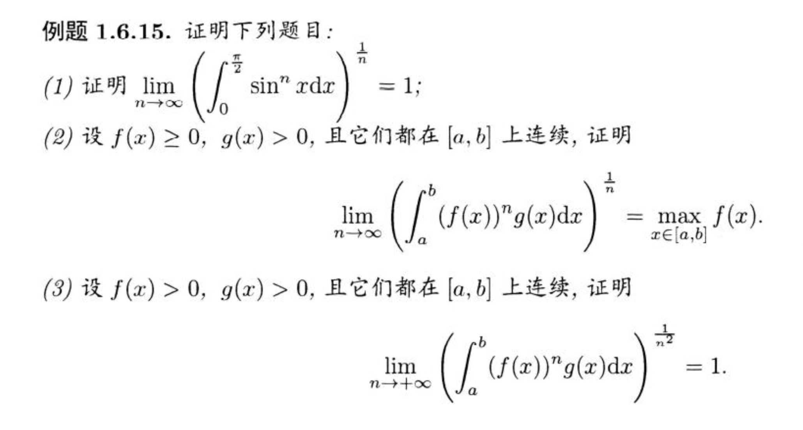
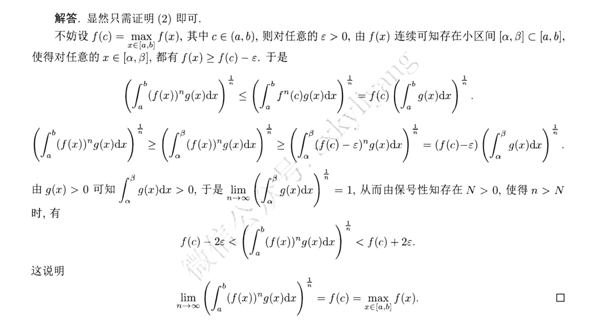

# 积分与极限 Cont. 细化区间

例4 设\(f\)在\([0,1]\)上连续，求

$$\lim_{n \to \infty} \int_{0}^{1} f(\sqrt[n]{x}) \mathrm{d}x$$

解 对于任意的正整数\(n\geqslant2\)，根据积分第一中值定理，存在\(\xi_{n}\in\left[0,\dfrac{1}{n}\right]\)及\(\eta_{n}\in\left[\dfrac{1}{n},1\right]\)，使得

\[
\int_{0}^{\frac{1}{n}}f(\sqrt[n]{x})\mathrm{d}x = f(\sqrt[n]{\xi_{n}})\cdot\frac{1}{n},\quad\int_{\frac{1}{n}}^{1}f(\sqrt[n]{x})\mathrm{d}x = f(\sqrt[n]{\eta_{n}})\cdot\left(1 - \frac{1}{n}\right).
\]

因为\(f\)在\([0,1]\)上是有界的，而有界量与无穷小量的乘积仍为无穷小量，所以

\[
\lim_{n\to\infty}f(\sqrt[n]{\xi_{n}})\cdot\frac{1}{n}=0
\]

又因\(\frac{1}{n}\leqslant\eta_{n}\leqslant1\)，故有\(\lim_{n\to\infty}\sqrt[n]{\eta_{n}} = 1\)。根据\(f\)在\(x = 1\)处的连续性，有

\[
\lim_{n\to\infty}f(\sqrt[n]{\eta_{n}})\cdot\left(1-\frac{1}{n}\right)=f(1)
\]

因此

\[
\lim_{n\to\infty}\int_{0}^{1}f(\sqrt[n]{x})\mathrm{d}x=\lim_{n\to\infty}\left(\int_{0}^{\frac{1}{n}}f(\sqrt[n]{x})\mathrm{d}x+\int_{\frac{1}{n}}^{1}f(\sqrt[n]{x})\mathrm{d}x\right) = f(1)
\]

---

2020微积分甲期末考第四题

(2) 求极限

$$\lim_{n\to\infty}\left(\int_{1}^{2}e^{-nt^{2}}\mathrm{d}t\right)^{\frac{1}{n}}$$

> 路老师写过答案

先考虑边界的数，\(e^{-t^{2}}\leq e^{-1}\)，当\(t\in[1,2]\)时成立

$$\int_{1}^{2}e^{-t^{2}}\mathrm{d}t\leq\int_{1}^{2}e^{-1}\mathrm{d}t = e^{-1}\Rightarrow \left(\int_{1}^{2}e^{-nt^{2}}\mathrm{d}t\right)^{\frac{1}{n}}\leq\left(\int_{1}^{2}e^{-n}\mathrm{d}t\right)^{\frac{1}{n}}=(e^{-n})^{\frac{1}{n}}=e^{-1}$$

另一方面，**利用函数极限**\(\lim\limits_{t\rightarrow1^{+}}e^{-t^{2}} = e^{-1}\)

即\(\forall\varepsilon>0\)，\(\exists\delta>0\)，当\(\vert x - 1\vert<\delta\)时，有\(\vert e^{-t^{2}}-e^{-1}\vert<\varepsilon\)

从而当\(t\in[1,1 + \delta]\)时，有\(e^{-t^{2}}>e^{-1}-\varepsilon\)成立

从而

$$\left(\int_{1}^{2}e^{-nt^{2}}\mathrm{d}t\right)^{\frac{1}{n}}\geq\left(\int_{1}^{1+\delta}e^{-nt^{2}}\mathrm{d}t\right)^{\frac{1}{n}}\geq\left(\int_{1}^{1+\delta}(e^{-1}-\varepsilon)^n\mathrm{d}t\right)^{\frac{1}{n}}=(e^{-1}-\varepsilon)\delta^{\frac{1}{n}}$$

**我们有极限$\lim\limits_{n\rightarrow\infty}\delta^{\frac{1}{n}} = 1$，所以**

对于上述$\varepsilon$，存在$N$，当$n>N$时，有$\delta^{\frac{1}{n}}>1-\varepsilon$

则\(\delta^{\frac{1}{n}}\cdot(e^{-1}-\varepsilon)>e^{-1}-2\varepsilon\)

**即对于任意\(\dfrac{1}{e}>\varepsilon>0\)，存在\(N\)，当\(n>N\)时，有**

$$e^{-1}-2\varepsilon<\int_{1}^{2}e^{-nt^{2}}\mathrm{d}t<e^{-1}<e^{-1}+2\varepsilon$$

**这是数列极限的$\varepsilon-N$定义**

$$\lim_{n\rightarrow\infty}\int_{1}^{2}e^{-nt^{2}}\mathrm{d}t = e^{-1}$$

!!! Tip

    其实$e^{-1}$是被积函数在$[1,2]$上的最大值，更一般的，本题的背景是下面这个结论

    

    

