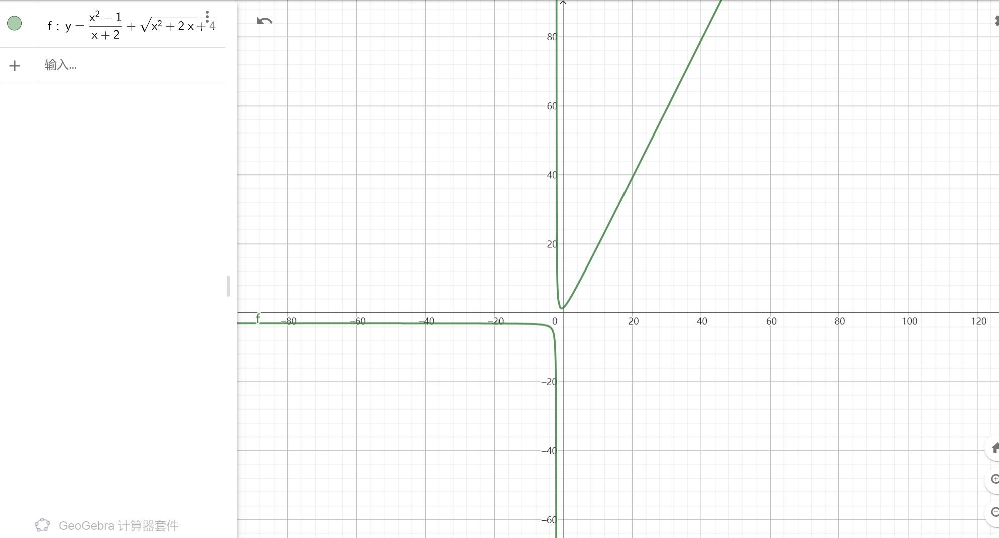
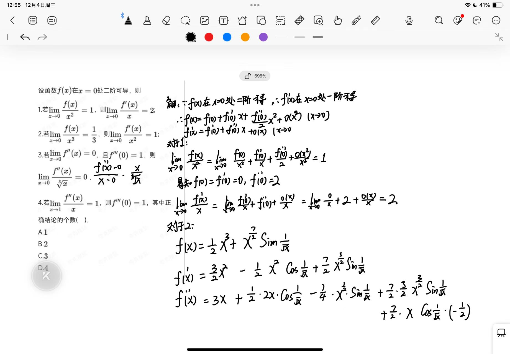
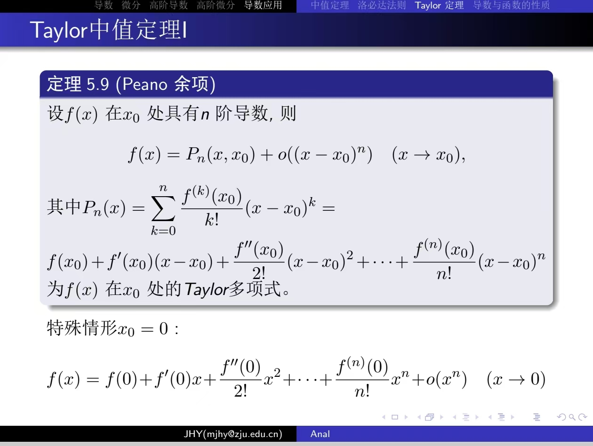
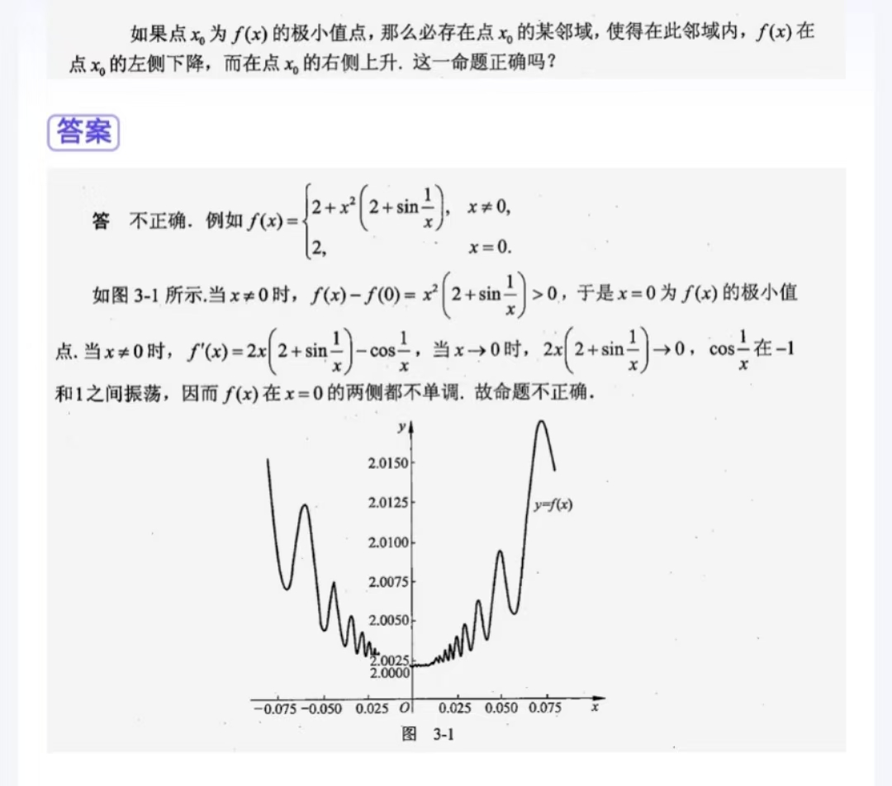
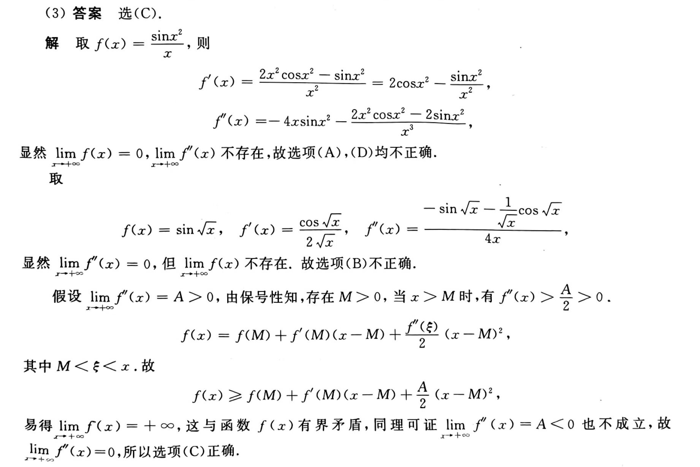

# 微甲小测(周三班)

1. 多选题(10分)
   曲线\(y = \dfrac{x^{2}-1}{x + 2}+ \sqrt{x^{2}+2x + 4}\)的渐近线共有___条。

   - A. 1;
   - B. 3;
   - C. 2;
   - D. 4;

考虑铅直渐近线和水平渐近线、斜渐近线。**B**

---

2. 多选题(10分)
   下列函数中，在\(x = 0\)处不可导的是

   - A. \(f(x)=x\cos|x|\)；
   - B. \(f(x)=\cos|x|\)；
   - C. \(f(x)=|x|\sin x\)；
   - D. \(f(x)=(1 - x)\sin|x|\)。

**D**

---

3. 多选题(10分)
   设\(f(x)=\dfrac{1}{x^{2}-3x + 2}\)，则：\(f^{(2024)}(0)=\)___。

   - A. \((1-\dfrac{1}{2^{2025}})2025!\)；
   - B. \((1-\dfrac{1}{2^{2024}})2024!\)；
   - C. \((1-\dfrac{1}{2^{2025}})2024!\)；
   - D. \((1-\dfrac{1}{2^{2024}})2025!\)。

**C**

---

4. 多选题(10分)
   极限\(\lim\limits_{x\to+\infty}x(\pi - 2\arctan x)=\)___。

   - A. 2.
   - B. \(-\pi\)；
   - C. \(-2\)；
   - D. \(\pi\)；

$x(\pi-2\arctan x)\sim x\tan(\pi-2\arctan x) = -x\dfrac{2x}{1-x^2}\to2(x\to+\infty)$

这是逆用$\tan x\sim x(x\to 0)$ 

**A**

---

5. 多选题(10分)
   设\(f(x)\)在\(x = 0\)处二阶可导，则：

   (1) 若\(\lim\limits_{x\to0}\dfrac{f(x)}{x^{2}}=1\)，则：\(\lim_{x\to0}\dfrac{f'(x)}{x}=2\)；

   (2) 若\(\lim\limits_{x\to0}\dfrac{f(x)}{x^{3}}=\dfrac{1}{3}\)，则：\(\lim_{x\to0}\dfrac{f'(x)}{x^{2}}=1\)；

   (3) 若\(\lim\limits_{x\to0}f''(x)=0\)，且\(f'''(0)=1\)，则：\(\lim\limits_{x\to0}\dfrac{f''(x)}{\sqrt[3]{x}}=0\)；

   (4) 若\(\lim\limits_{x\to0}\dfrac{f''(x)}{x}=1\)，则：\(f'''(0)=1\)。
   
   上述陈述中，正确结论的个数为【 】
   
   - A. 4；
   - B. 1；
   - C. 2；
   - D. 3；

**注意：只知道在一点可导，不能使用洛必达法则**

(2)亦可举反例：$f(x) = x^3(\dfrac{1}{3}+x\sin(\dfrac{1}{x}))$

(3)(4)利用导数定义和极限四则运算

**D**

---

6. 多选题(10分)
   下列陈述错误的是
   
   - A. 区间\(I\)上的连续函数一定有界
   - B. 函数\(f(x)=\begin{cases}2e^{x}&x < 0\\2x + 1&x\geq0\end{cases}\)的原函数为\(F(x)=\begin{cases}2e^{x}+C - 2&x < 0\\x^{2}+x + C&x\geq0\end{cases}\)
   - C. 若\(f'(0)<0\)，则：\(\exists\delta>0\)，使得\(f(x)\)在区间\((0,\delta)\)内单调递减。
   - D. 若\(f(x)\)在\(U(x_{0})\)内可导，且在\(x_{0}\)处有极大值，则：一定存在\(\delta>0\)，使得\(f(x)\)在\((x_{0}-\delta,x_{0})\)内单调递增，在\((x_{0},x_{0}+\delta)\)内单调递减。

**ABCD**

B 不存在原函数（

!!! Note

    原函数 存在性定理

       - (1) 连续函数\(f(x)\)必有原函数
       - (2) 含有第一类间断点，无穷间断点的函数\(f(x)\)在包含该间断点的区间内必不存在原函数

       连续函数一定存在原函数，反之是不对的

       有第一类间断点的函数一定不存在原函数，但有第二类间断点的函数可能有原函数，如：\(F(x)=\begin{cases}x^{2}\sin\dfrac{1}{x}&x\neq0\\0&x = 0\end{cases}\)，\(f(x)=\begin{cases}2x\sin\dfrac{1}{x}-\cos\dfrac{1}{x}&x\neq0\\0&x = 0\end{cases}\)，显然有\(F'(x)=f(x)\)，但\(x = 0\)为\(f(x)\)的第二类间断点
 
    定积分 存在性充分条件

       - (1) 若\(f(x)\)在\([a,b]\)上连续，则\(\int_{a}^{b}f(x)dx\)存在
       - (2) 若\(f(x)\)在\([a,b]\)上单增，则\(\int_{a}^{b}f(x)dx\)存在
       - (3) 若\(f(x)\)在\([a,b]\)上有界，且只有有限个间断点，则\(\int_{a}^{b}f(x)dx\)存在
 
 
    变限积分的性质

       - 函数\(f(x)\)在\([a,b]\)上可积，则函数\(F(x)=\int_{a}^{x}f(t)dt\)在\([a,b]\)上连续
       - 函数\(f(x)\)在\([a,b]\)上连续，则函数\(F(x)=\int_{a}^{x}f(t)dt\)在\([a,b]\)上可导
 
    积分上限函数

       设\(f(x)\)连续或有有限个第一类间断点，令\(F(x)=\int_{a}^{x}f(t)dt\)，则：当\(x_{0}\)为\(f(x)\)的第一类间断点时，\(F(x)\)在\(x = x_{0}\)处连续；当\(x_{0}\)为\(f(x)\)的连续点时，\(F(x)\)在\(x = x_{0}\)处可导。

---

7. 多选题(10分)
   设\(f(x)\)在\(x = 1\)处可导，且\(f(1)=0\)，\(f'(1)=2025\)，
   则：\(\lim\limits_{x\to0}\dfrac{f(\cos2x)}{\ln(1 - 2x^{2})}=\)___。

   - A. $4050$；
   - B. $2025$；
   - C. \(-2025\)；
   - D. \(-4050\)；

$\lim\limits_{x\to0}\dfrac{f(\cos2x)}{\ln(1 - 2x^{2})} = \lim\limits_{x\to0}\dfrac{f(\cos2x)}{\cos 2x-1}\dfrac{\cos 2x-1}{\ln(1-2x^2)}$

$\dfrac{\cos 2x-1}{\ln(1-2x^2) } \sim \dfrac{-2x^2}{-2x^2} = 1(x\to 0)$

**B**

---

8. 多选题(10分)
   极坐标系下的曲线\(C:r = 2\theta\)在\(\theta=\pi\)处的切线方程为

   - A. \(y=\pi x + 2\pi-\pi^{2}\)。
   - B. \(y=\pi x + 2\pi\)；
   - C. \(r - 2\pi=2(\theta-\pi)\)；
   - D. \(y=\pi x + 2\pi^{2}\)；

切点$(-2\pi,0),k = \pi$ 

**D**

---

9. 多选题(10分)
   设\(y = f(x)\)是由方程\(e^{xy}+x + y = 2\)确定的隐函数，则\(\lim\limits_{n\to+\infty}n[f(\dfrac{1}{n})-1]=\)___。

   - A. \(-1\)；
   - B. \(1\)；
   - C. \(2\)；
   - D. \(-2\)；

$e^{xy}(y+xy')+1+y' = 0\Rightarrow y' = -2$

**D**

---

10. 多选题(10分)
    下列命题中正确的是

    - A. 若\(f'(x)\)在\((0,1)\)内有界，则：\(f(x)\)在\((0,1)\)内必有界；
    - B. 方程\(\ln x-\dfrac{e}{x}+2025 = 0\)有且仅有一个实根；
    - C. 若\(f(x)\)在\((0,1)\)内可微且有界，则：导函数\(f'(x)\)在\((0,1)\)内必有界；
    - D. 方程\(\ln x-\dfrac{x}{e}+2025 = 0\)恰有两个不同的正根；

A   $|f(x)| = |f(x)-f(\dfrac{1}{2})+f(\dfrac{1}{2})|\le |f'(\xi)|+|f(\dfrac{1}{2})|$(Lagrange)

B   $x\ln x = -2025x+e$

C   $f(x) = x^{1.5}\sin(\dfrac{1}{x})(f(0) = 0)$

**ABD**

---

补充一个题

