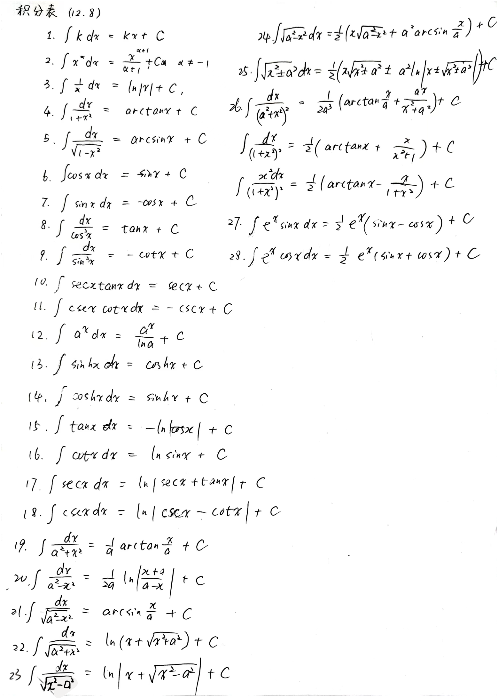

# 不定积分表

## 背景补充

### 双曲正弦函数

$y = \sinh x = \dfrac{e^x - e^{-x}}{2}$

反函数

$y = \ln(x + \sqrt{x^2 + 1})$

### 双曲余弦函数

$y = \cosh x = \dfrac{e^x + e^{-x}}{2}$

反函数

$y = \ln(x + \sqrt{x^2 - 1})$

### 双曲正切函数

$y = \tanh x = \dfrac{\sinh x}{\cosh x} = \dfrac{e^x - e^{-x}}{e^x + e^{-x}}$

反函数

$y = \dfrac{1}{2}\ln\dfrac{1 + x}{1 - x}$

---

为何叫双曲三角函数呢，是因为他们跟三角函数有类似的性质，甚至存在双曲三角函数线，有兴趣的同学可以参考知乎的两篇文章

[三角函数的孪生兄弟，双曲函数](https://zhuanlan.zhihu.com/p/398460302)

[双曲函数的一些公式](https://zhuanlan.zhihu.com/p/338449318)

了解了双曲三角函数以后，一些不定积分公式也容易理解了

贴一张我在大一抄写的不定积分表

